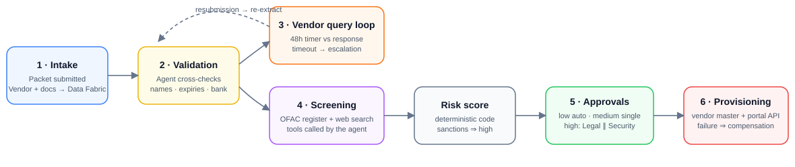
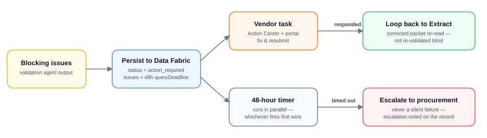
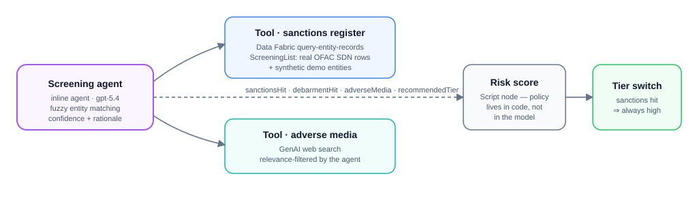
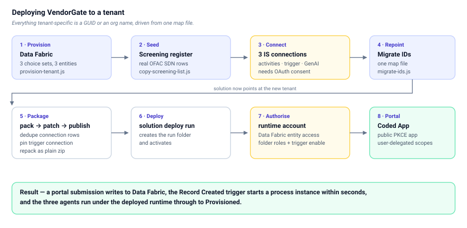

# VendorGate — vendor onboarding & risk clearance

A UiPath **Maestro Flow** solution built for the Maestro Flow Challenge.

Straight-through vendor registration is a solved problem. **VendorGate starts where
the old automation gave up** — the packet that doesn't validate cleanly. The
exception paths are the main event: a 48-hour human-vs-timer race, agent-driven
cross-document validation, sanctions screening against **real OFAC data**,
risk-tiered parallel approvals, and compensation when provisioning fails.

The pipeline is **event-driven end to end**: submitting through the portal writes
the packet to Data Fabric, and the flow's *Record Created* trigger picks it up
within seconds — no manual start, no polling glue code. Document text is
extracted client-side (pdf.js) at upload, so the flow works from raw text through
a generative extraction agent.

One `.uipx` solution, one deployable artifact, two projects:

```
VendorGate.uipx
├── VendorClearance   Maestro Flow  — the orchestration
└── VendorPortal      Coded App    — vendor portal + procurement console
```

## Watch the demo

[](https://youtu.be/1rHno7CtIBk)

*A portal submission starts a real process instance, three agents clear the packet, and a sanctions hit fans out to parallel approvals.*

| | |
|---|---|
| **Demo video** | **<https://youtu.be/1rHno7CtIBk>** |
| Flow canvas | [Studio Web designer](https://staging.uipath.com/shakertechs/studio_/designer/a0978eee-a8ab-41a3-aa91-3bdb35e3bf1f) |
| Live portal | <https://shakertechs.staging.uipath.host/vendor-portal> |
| Deployed process | `Shared/VendorGate Run` → `VendorClearance` |
| Demo runbook | [DEMO.md](DEMO.md) |
| Feature list | [FEATURES.md](FEATURES.md) |
| Deployment guide | [§ Deploying to your own tenant](#deploying-to-your-own-tenant) |
| License | MIT ([LICENSE](LICENSE)) |
| Studio Web export | [VendorGate.uis](VendorGate.uis) — import directly into Studio Web |

## UiPath components used

| Component | Where |
|---|---|
| **Maestro Flow** | The whole orchestration — BPMN-backed long-running flow with timer, parallel gateway, boundary-error compensation |
| **Connector trigger** | Data Fabric *Record Created* on `Vendor` — a portal submission starts a process instance, no manual trigger |
| **Inline Agents** (×3) | Generative extraction · cross-document validation · sanctions screening, all with typed input/output schemas chained node-to-node |
| **Agent tools** (IS connector tools) | Data Fabric `query-entity-records` (sanctions register) + GenAI Web Search (adverse media), called by the screening agent *inside* the flow |
| **Data Fabric** | `Vendor`, `VendorDocument`, `ScreeningList` entities — durable state the flow writes and the portal reads; file attachments for uploaded documents |
| **Action Center (HITL)** | Vendor query task, procurement escalation, single + parallel approvals — every task carries a full decision-ready case file |
| **Integration Service** | Data Fabric + UiPath GenAI connections backing the connector nodes and agent tools |
| **Managed HTTP** | Vendor-portal provisioning call (error port wired to compensation) |
| **Coded App (AppV2)** | `VendorPortal` — React/TS vendor portal + procurement console, registered in the same `.uipx` solution |
| **Agent Evals** | Ground-truth eval sets per agent, incl. an adversarial trade-name case and fuzzy sanction-variant cases |
| **Solutions packaging** | `uip solution pack` produces one deployable artifact containing the Flow and the App |

---

## The pipeline



A supplier submits a packet of four documents — trade licence, insurance
certificate, bank details letter, ISO certificate. The flow persists every state
transition to **Data Fabric**, so a run can pause for 48 hours on a human task
and resume against durable state, and the portal reads live progress at any time.

### 1 · Event-driven intake & generative extraction

The portal writes the `VendorDocument` rows first and the `Vendor` row last —
that final insert *is* the trigger event. The flow then claims the newest
unprocessed submission, moves it to `extracting`, fetches its documents back out
and assembles the packet text.

A guard sits immediately after the trigger: a submission only proceeds if it
carries a contact address and is still in `submitted` state, so snapshot imports
and backfills never spawn instances.

An **extraction agent** then turns the packet into typed document records: give
it raw unstructured text (OCR output, pasted document contents — see
`test-data/debug-vendor-a-rawtext.json`) and it extracts the four documents
generatively, reporting anything ambiguous in its extraction notes; give it
pre-structured JSON and it normalises and passes through. Names are copied
exactly as written — suffix drift like *FZE* vs *LLC* is evidence for the next
agent, never silently normalised away.

### 2 · Cross-document validation (inline agent)

Not per-document field checking — the point is **consistency across documents**:
the legal entity name must match everywhere (suffix drift like *FZE* vs *LLC* is
a blocking finding, a declared trade name is not), nothing may be expired or
near expiry, the bank account holder must be the licensed entity, and the
licence jurisdiction must match the stated country. Typed output: an issue list
with severities, discovered name variants, and a confidence.

### 3 · The vendor query loop



When blocking issues exist, the vendor gets a task listing exactly what's wrong
— and a **48-hour timer starts in parallel**. Response wins: the flow loops back
to the document fetch, so corrected documents are re-read and re-extracted rather
than re-judged blind. Timeout wins: **escalation to a procurement officer**,
recorded on the vendor's record. Nothing fails silently.

### 4 · Screening (inline agent + live tools)



The screening agent calls two tools *inside the flow* — a Data Fabric query
against the `ScreeningList` register (seeded with **real OFAC SDN entities**
from the US Treasury's public endpoint, plus synthetic demo entities), and a
GenAI web search for adverse media. Matching is deliberately fuzzy: suffix
variants and punctuation differences still hit. Every verdict carries the
matched record and a written rationale.

### 5 · Risk & approvals

Judgment lives in the agents; **policy lives in code**. A Script node scores
0–100 deterministically, with one compliance override: a sanctions or debarment
hit can never route below high. Low auto-clears, medium takes one approver,
high fans out to **Legal ∥ Security in parallel — both must return**.

A *case file* node flattens both agents' findings into reviewer-readable lines
before the tier switch, so every approval task answers the question a reviewer
actually has — **why is this on my desk?** Tasks carry the register verdict, the
score against the agent's recommendation, the validation issues, adverse media,
name-consistency findings, both agents' confidence scores, and a box for the
approver's written reason, which is recorded on the vendor.

### 6 · Provisioning & compensation

The vendor master record is written, then the portal API is called. On failure,
a **compensation step unwinds the record to `Failed`** with a structured reason
— this path has been executed live, not just drawn.

---

## The portal

**Vendors** land on a two-card gate: *New submission* (form + four document
uploads, stored as Data Fabric file attachments, with text extracted in the
browser) or *Track my submission* — a named stage strip with a "you are here"
marker, plain-language status, the validation feedback when action is required,
their documents, and a resubmission panel that uploads corrected files and puts
the case back in the pipeline.

**Procurement** gets a console: live KPI tiles, a searchable and filterable
vendor table, and per-vendor drill-in showing documents, screening evidence
(register hits, recommended tier, confidence, rationale, adverse media), the
validation issues, and actions — including *send back to vendor* with a written
note that lands on the vendor's tracking page.

Visitors who are not signed in get a **fully interactive demo sandbox** built
from a bundled snapshot of real pipeline data, mutated only in their browser tab.
Signing in switches the same UI to live Data Fabric state.

---

## Running a vendor through

Prereqs: [`uip` CLI](https://www.npmjs.com/package/@uipath/cli) ≥ 1.198, Node 18+,
and `uip login` into the target tenant.

```bash
cd VendorGate

# Validate + push the solution to Studio Web
uip maestro flow validate VendorClearance/VendorClearance.flow
uip solution upload . --force

# Seed a submission the way the portal would (documents first, vendor row last)
node test-data/seed-trigger-test.js test-data/debug-vendor-a-rawtext.json

# Run it
cd VendorClearance && uip maestro flow debug .
```

> `flow validate` reports **15 errors that are known false positives** — 7 sticky
> notes (canvas-native notes carry no registry definition) and 8 HITL outcome
> edges (the runtime accepts per-outcome ports that the validator's schema does
> not yet declare). Both are runtime-verified.

> Start runs from the **terminal**, not the canvas *Run* button. Launching from
> Studio Web regenerates the screening agent's tool configuration as it starts,
> which turns its numeric parameters into strings and resets the pinned entity.
> `node test-data/preflight.js` checks and repairs that file, pushes it, and
> re-verifies the cloud copy — run it before any demo.

### Test data

Everything lives in `VendorGate/test-data/`.

| Path | What it is |
|---|---|
| `debug-vendor-a-rawtext.json` | **Clean** vendor as raw unstructured packet text — exercises generative extraction |
| `debug-vendor-a-clean.json` | Same vendor, pre-structured JSON — exercises the passthrough path |
| `debug-vendor-b-defective.json` | **Defective**: expired insurance, bank holder mismatch, name drift → query loop |
| `debug-vendor-c-sanctioned.json` | **Sanctioned**: clean documents, register hit → high tier, parallel approvals |
| `documents/vendor-a-clean/` etc. | Synthetic PDF packets (4 documents + a combined packet) for portal uploads |
| `sample-uploads/` | Public-domain PDFs for upload smoke tests |

| Vendor | Legal name | Country | Expected outcome |
|---|---|---|---|
| A | Aurora Steel Industries LLC | AE | Auto-cleared → `Provisioned`, low tier |
| B | Zenith Gulf Trading FZE | AE | 3 blocking issues → `Action required` + 48h deadline |
| C | Crimson Horizon Trading FZE | AE | Sanctions hit → score 40 → **high** → Legal ∥ Security |

All vendor data is synthetic. The only real-world data is the OFAC SDN register.

### Helper scripts

```bash
cd VendorGate

node test-data/seed-trigger-test.js  <payload.json>   # seed a raw-text submission
node test-data/seed-structured.js    <payload.json>   # seed a structured submission
node test-data/preflight.js                           # repair + verify the agent tool file
node test-data/df-export.js  snapshot.json            # export all three entities
node test-data/df-import.js  snapshot.json            # re-import them
node test-data/make-pdfs.js                           # regenerate the synthetic PDFs
node test-data/relayout.js  VendorClearance/VendorClearance.flow   # rebuild the canvas layout
```

Add `VG_PROFILE=<name>` before a seed command to target a non-default `uip` login
profile.

---

## Deploying to your own tenant



The solution is portable; everything tenant-specific is a GUID or an org name,
and all of it is driven from one map file. A fresh tenant takes about an hour,
most of it waiting on OAuth consent screens.

### 1 · Provision Data Fabric

```bash
cd VendorGate
uip login                                    # or: uip login --profile <name>
node test-data/provision-tenant.js           # add --profile <name> for a named login
```

Creates three choice sets (`VendorStatus`, `RiskTier`, `DocType` — **order
matters**, the flow writes the numeric position) and three entities (`Vendor`,
`VendorDocument`, `ScreeningList`) with the exact field types the flow expects.
It is idempotent and prints the new entity IDs at the end.

### 2 · Seed the screening register

```bash
node test-data/copy-screening-list.js <sourceEntityId> <targetEntityId> --to-profile <name>
```

Copies the register from an existing tenant. To build it from scratch instead,
pull the public OFAC SDN feed
(`https://sanctionslistservice.ofac.treas.gov/api/PublicationPreview/exports/SDN.CSV`,
a User-Agent header is required) and insert rows with
`entityName` / `listType` / `country` / `reason`. Keep the register to a few
dozen rows — the screening agent retrieves it whole for fuzzy matching, and
detection degrades on very large registers.

### 3 · Create Integration Service connections

You need **three**, and they must be reachable by the account that runs the
deployed process:

```bash
uip is connections create uipath-uipath-dataservice --no-browser --no-wait   # activities
uip is connections create uipath-uipath-dataservice --no-browser --no-wait   # trigger
uip is connections create uipath-uipath-airdk       --no-browser --no-wait   # GenAI
```

Open each returned URL and approve it. The trigger needs its **own** Data Fabric
connection — sharing one with the activity nodes makes the Orchestrator installer
fail on a duplicate key.

### 4 · Repoint the solution

Copy `test-data/tenants/staging.json` to a new map file and replace each value
with your own IDs, then:

```bash
node test-data/migrate-ids.js test-data/tenants/<yours>.json --dry-run
node test-data/migrate-ids.js test-data/tenants/<yours>.json
```

The map covers Data Fabric entity IDs, the three connection IDs, folder keys,
the portal's OAuth client, the org/tenant names, the API base URL and the
canvas icon host. Reverse the pairs to migrate back.

Then give the solution a fresh identity so it uploads as a new Studio Web
solution rather than trying to overwrite the original:

```bash
node -e "const f='VendorGate.uipx',j=require('./'+f);j.SolutionId=require('crypto').randomUUID();require('fs').writeFileSync(f,JSON.stringify(j,null,4))"
uip solution upload .
```

### 5 · Pack, patch, publish, deploy

The CLI packager emits each connection **twice** in the packed flow package —
once lower-case, once capitalised — and the Orchestrator installer builds a
dictionary from that list and fails with *"An item with the same key has already
been added"*. `patch-package2.js` fixes the package after packing:

```bash
uip solution pack . ../out -v 1.0.0

# unpack → patch → repack, then publish and deploy
#   (see test-data/patch-package2.js for the exact steps; it dedupes the
#    connection rows, pins the trigger to its own connection, and re-injects
#    the activity connection dependencies the manifest generator drops)

uip solution publish ../out/VendorGate_1.0.0_patched.zip
uip solution deploy config get VendorGate --destination config.json
uip solution deploy run --name <deployment> --package-name VendorGate \
  --package-version 1.0.0 --folder-name "VendorGate Run" \
  --parent-folder-path Shared --config-file config.json
```

Repack **with `tar --format zip`** (or any tool that writes plain zip entries
with forward slashes). A `.nupkg` written as a TAR, entries prefixed `./`, or
backslash separators are all rejected by the deploy validator.

> A **failed** deployment burns its name permanently — it cannot be uninstalled.
> A **draft** deployment can be. Use a fresh name after a failure.

### 6 · Grant the runtime account access

The deployed process runs as a service identity, not as you. It needs:

- **Data Fabric** — Manage access on each entity, granting the robot account
  read/write.
- **Orchestrator roles** — `Automation User` + `Folder Administrator` on the
  deployment folder *and* on the folder holding the connections, plus the
  tenant-level `Allow to be Automation User`.
- **Connections** — the agent tools resolve connections through a different
  permission path than the flow's connector nodes. If the tools report
  *"does not have the Connections.View permission"* while the flow nodes work,
  point the tool files at connections in a folder where the account has broader
  rights.

### 7 · Enable the trigger

If the deploy's activation step reports a 404 on the event trigger, enable it
once from the Orchestrator UI (folder → **Triggers**). Later deploys then
activate cleanly.

### 8 · Deploy the portal

```bash
uip admin external-apps create "VendorGate Portal" --non-confidential \
  --redirect-uri "https://<org>.uipath.host/vendor-portal,http://localhost:5173" \
  --user-scope "DataFabric.Schema.Read,DataFabric.Data.Read,DataFabric.Data.Write"
```

The portal signs users in with PKCE, so the app must be **non-confidential** and
its Data Fabric scopes must be **user (delegated)** scopes — application scopes
produce an `Invalid scope` error at sign-in. Put the returned client ID, your org
and tenant names and the API base URL into your tenant map, re-run
`migrate-ids.js`, then:

```bash
cd VendorPortal/source
npm install && npm run build
uip codedapp pack dist -n vendor-portal --version 1.0.0
uip codedapp publish
uip codedapp deploy -n vendor-portal --folder-key <folder-guid>
```

The deploy prints the live URL; register it back on the External App if it
differs from what you guessed.

---

## What is real vs. what is a stand-in

Honesty table — every stand-in sits behind a swappable node.

| Component | Status |
|---|---|
| Flow orchestration (HITL race, parallel join, compensation) | **Real — executed live** |
| Event-driven intake (Data Fabric trigger → deployed instance) | **Real — deployed, fires in seconds** |
| Data Fabric persistence (status, issues, deadlines, screening evidence) | **Real** |
| Extraction, validation and screening agents, typed IO, chained outputs | **Real — verified on the deployed process** |
| Agent tool calls (register query, web search) inside the flow | **Real** |
| Sanctions register content | **Real OFAC SDN rows** + synthetic demo entities |
| Risk scoring & compliance override | **Real (deterministic code)** |
| Portal (submission, uploads, tracking, resubmission, admin console) | **Real, live** |
| Document text extraction | Browser-side (pdf.js) at upload; an IxP model is the swap-in for scanned or image-only PDFs |
| Eval datasets (7 cases incl. adversarial) | Authored; run from the Studio Web canvas |
| ERP provisioning | **Stand-in** — writes vendor-master state to Data Fabric; an RPA package drops in |
| Vendor portal provisioning API | **Stub** — echo endpoint behind a managed HTTP node |
| Vendor identity / portal auth separation | Demo-grade: one UiPath login, tab-based roles |

## Repository map

```
DEMO.md              demo runbook — run order, script, pitfalls
FEATURES.md          feature inventory
docs/                architecture SVGs used above
VendorGate/
  VendorGate.uipx    solution manifest (Flow + AppV2)
  VendorClearance/   the Maestro Flow, three inline agents, agent tools, eval sets
  VendorPortal/      coded app (source/ = Vite + React + TS + Tailwind)
  test-data/         payloads, synthetic PDFs, seeding, snapshots, tenant migration
    tenants/         per-tenant ID maps for migrate-ids.js
```
